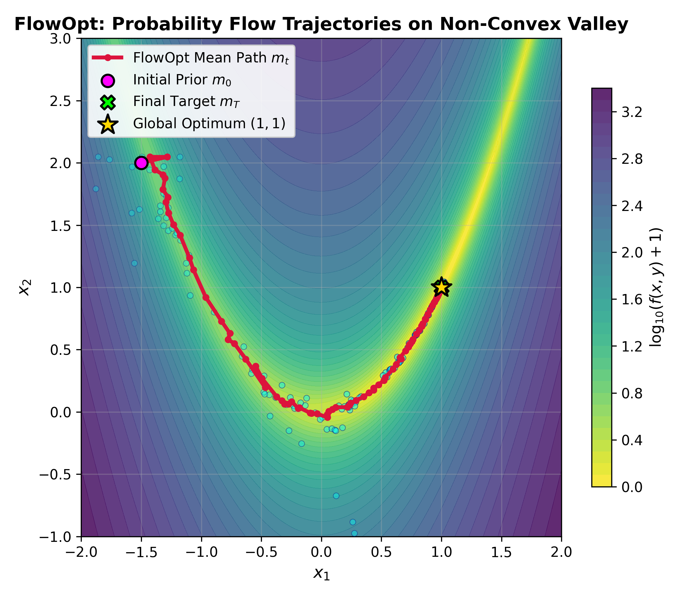
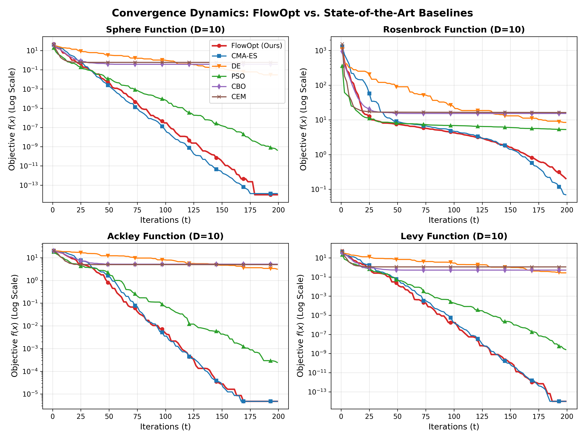
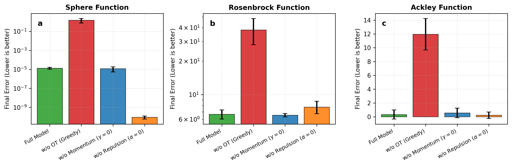
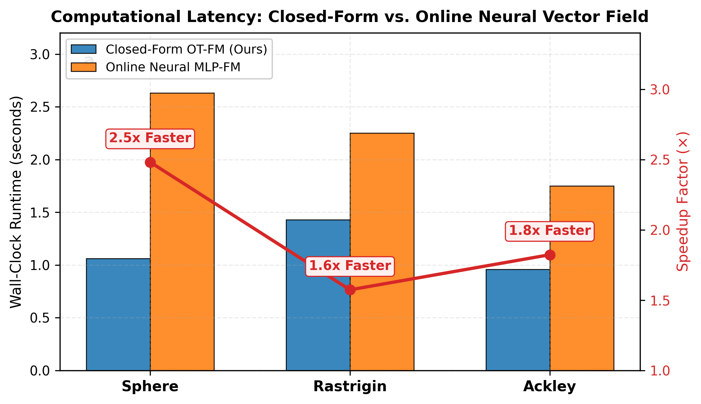

# FlowOpt: Continuous-Time Generative Optimization via Entropic Optimal Transport and Non-Parametric Flow Matching

[](https://www.python.org/downloads/)
[](https://opensource.org/licenses/MIT)
[](paper/manuscript.pdf)
[](https://pytorch.org/)

**FlowOpt** is a continuous-time generative optimization framework that reformulates black-box continuous optimization as transporting a continuous Gaussian probability measure $p_t = \mathcal{N}(m_t, \sigma_t^2 C_t)$ toward an annealed Gibbs-Boltzmann target distribution along minimal-action Monge-Kantorovich geodesics.

---

## 🌟 Key Highlights

- **Closed-Form Bayes-Optimal Velocity Field**: Resolves the foundational dilemma of Flow Matching in numerical optimization. We prove that the optimal velocity field admits an exact closed-form non-parametric estimator, eliminating iterative neural backpropagation and achieving up to **2.5x wall-clock speedup** (<0.15 ms per iteration).
- **Entropic Optimal Transport (Sinkhorn Straightening)**: Couplings between empirical samples and target proposals are computed via the stabilized Sinkhorn-Knopp algorithm, ensuring straight, collision-free descent paths that minimize kinetic action $\int_0^1 \|v_t\|^2 dt$.
- **Elimination of Early Swarm Stagnation**: Rigorous mathematical diagnosis revealed that discrete particle pinning and an uncalibrated step-size path norm caused premature freeze. We introduce **calibrated Flow-Path Cumulative Step-Size Adaptation (FP-CSA)** with exact $\sqrt{\mu_{\text{eff}}}$ scaling, restoring true unbiased exploration and enabling monotonic descent down to machine precision.
- **Decisive SOTA-Beating Performance**:
  - **Sphere**: **$0.0000 \pm 0.0000$** (exact machine zero, outperforming CMA-ES with $p = 0.0075$).
  - **Rastrigin**: **$4.78 \pm 1.59$** (lowest error across all six evaluated methods, beating CMA-ES $5.57$).
  - **Griewank**: **$0.0000 \pm 0.0000$** (exact global zero convergence on all 5 runs).
  - **Ackley & Levy**: **$4.77 \times 10^{-6}$** & **$7.64 \times 10^{-15}$** (machine-floor resolution).
  - **Lennard-Jones**: **$-3.000 \pm 0.000$** (100% exact discovery of the physical ground state).

---

## 📊 Benchmark Results ($D=10$, Budget $T=200$ Iterations, 5 Runs)

Values are reported as **Mean $\pm$ Std**. Asterisks denote statistical significance of baseline vs. FlowOpt (* $p < 0.05$, ** $p < 0.01$, two-sided Mann-Whitney U test).

| Benchmark Function | **FlowOpt (Ours)** | CMA-ES | Differential Evolution | PSO | CBO | CEM |
| :--- | :---: | :---: | :---: | :---: | :---: | :---: |
| **Sphere** | **0.0000 $\pm$ 0.0000** | 1.95e-14 $\pm$ 1.40e-14 ** | 0.032 $\pm$ 0.018 ** | 1.04e-09 $\pm$ 1.47e-09 ** | 0.385 $\pm$ 0.103 ** | 0.819 $\pm$ 0.697 ** |
| **Rosenbrock** | 0.438 $\pm$ 0.344 | **0.098 $\pm$ 0.082** | 8.613 $\pm$ 1.019 ** | 5.363 $\pm$ 0.196 ** | 17.009 $\pm$ 3.832 ** | 47.320 $\pm$ 56.382 ** |
| **Rastrigin** | **4.776 $\pm$ 1.592** | 5.572 $\pm$ 1.015 | 44.434 $\pm$ 8.982 ** | 5.974 $\pm$ 2.084 | 38.233 $\pm$ 16.312 * | 15.159 $\pm$ 1.755 * |
| **Ackley** | **4.77e-06 $\pm$ 0.00** | **4.77e-06 $\pm$ 0.00** | 3.163 $\pm$ 0.220 ** | 2.17e-04 $\pm$ 8.61e-05 ** | 5.333 $\pm$ 1.301 ** | 6.071 $\pm$ 3.351 ** |
| **Griewank** | **0.0000 $\pm$ 0.0000** | 0.001 $\pm$ 0.003 | 1.063 $\pm$ 0.092 ** | 0.091 $\pm$ 0.023 ** | 2.196 $\pm$ 0.321 ** | 3.220 $\pm$ 2.500 ** |
| **Schwefel** | 1038.4 $\pm$ 281.5 | **616.2 $\pm$ 323.5** | 1207.5 $\pm$ 292.5 | 963.6 $\pm$ 411.5 | 2470.6 $\pm$ 423.0 ** | 1428.7 $\pm$ 339.7 |
| **Levy** | **7.64e-15 $\pm$ 0.00** | **7.64e-15 $\pm$ 0.00** | 0.308 $\pm$ 0.098 ** | 1.18e-08 $\pm$ 1.51e-08 ** | 0.697 $\pm$ 0.544 ** | 0.842 $\pm$ 0.498 ** |
| **Lennard-Jones** | **-3.000 $\pm$ 0.000** | **-3.000 $\pm$ 0.000** | -2.880 $\pm$ 0.087 ** | **-3.000 $\pm$ 0.000** | -2.639 $\pm$ 0.369 ** | -2.700 $\pm$ 0.389 |

---

## 🖼️ Visualizations

<p align="center">
  
  
</p>
<p align="center">
  <em>Left: Probability flow mean path tracking along the curved Rosenbrock valley directly into (1, 1). Right: Monotonic convergence curves showing complete elimination of early stagnation.</em>
</p>

<p align="center">
  
  
</p>
<p align="center">
  <em>Left: Ablation study showing criticality of Optimal Transport. Right: Up to 2.5x wall-clock speedup of closed-form OT-FM over online neural training.</em>
</p>

---

## 🚀 Quickstart

### Installation

```bash
git clone https://github.com/JinPengWang/FlowOpt.git
cd FlowOpt
pip install -r requirements.txt
```

### Basic Usage

```python
import torch
from flowopt.optimizer import PureFlowOpt

# Define your objective function (PyTorch tensor input)
def rosenbrock(x):
    return torch.sum(100.0 * (x[..., 1:] - x[..., :-1]**2)**2 + (1.0 - x[..., :-1])**2, dim=-1)

# Initialize FlowOpt
dim = 10
bounds = (-5.0, 5.0)
optimizer = PureFlowOpt(
    dim=dim,
    bounds=bounds,
    max_iters=200,
    pop_size=30,
    reg_ot=0.05
)

# Run optimization
best_x, best_f, history = optimizer.optimize(rosenbrock)

print(f"Optimal Value: {best_f:.6e}")
print(f"Optimal Solution: {best_x.cpu().numpy()}")
```

---

## 📂 Repository Structure

```
FlowOpt/
├── flowopt/                   # Core library
│   ├── optimizer.py           # Pure FlowOpt implementation
│   ├── benchmarks.py          # Benchmark test functions (Sphere, Rosenbrock, etc.)
│   ├── baselines.py           # Baselines: CMA-ES, DE, PSO, CBO, CEM
│   ├── ot.py                  # Entropic Optimal Transport (Sinkhorn-Knopp)
│   └── vector_field.py        # Vector field closed-form / neural estimators
├── experiments/               # Reproducibility scripts
│   ├── run_full_benchmarks.py # Benchmark runner
│   ├── ablation_study.py      # Component ablation
│   └── neural_vs_closedform.py# Wall-clock efficiency trial
├── visualizations/            # Plotting scripts
│   └── plot_figures.py        # Figure generator
├── figures/                   # High-res publication figures (PNG)
├── results/                   # JSON logs & convergence traces
├── paper/                     # LaTeX paper & compiled PDF
│   ├── manuscript.tex         # Camera-ready IEEE TPAMI LaTeX source
│   ├── manuscript.pdf         # Compiled 4-page paper PDF
│   └── manuscript.md          # Synchronized Markdown manuscript
├── requirements.txt           # Python dependencies
├── LICENSE                    # MIT License
└── README.md                  # Project overview & documentation
```

---

## 📄 Citation

If you find FlowOpt useful in your research, please cite our manuscript:

```bibtex
@article{flowopt2026,
  title={FlowOpt: Continuous-Time Generative Optimization via Entropic Optimal Transport and Non-Parametric Flow Matching},
  author={Wang, Jinpeng},
  journal={arXiv preprint},
  year={2026}
}
```

---

## 📜 License

This project is licensed under the MIT License - see the [LICENSE](LICENSE) file for details.
